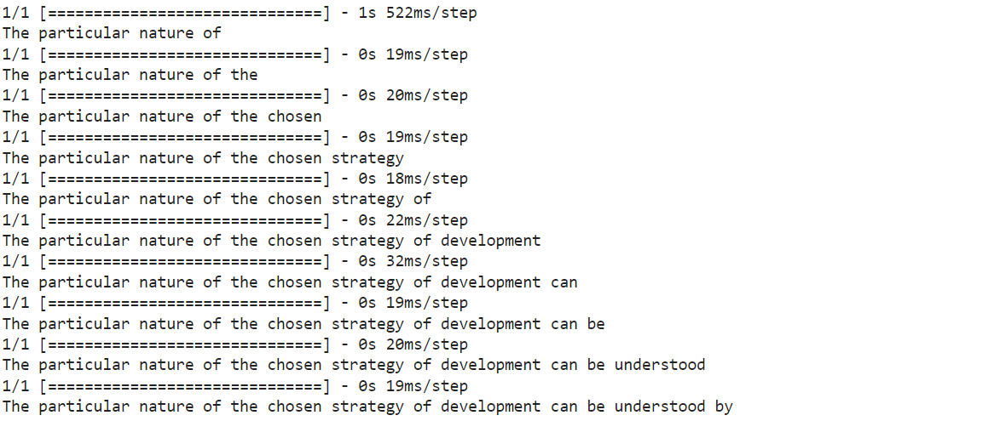

# Next Word Predictor using LSTM

This project implements a next word predictor using Long Short-Term Memory (LSTM) neural networks. The predictor is trained on a dataset containing text samples and their corresponding next words. The model learns the patterns in the text data to predict the next word given a sequence of words.

## Introduction

The next word predictor utilizes LSTM neural networks to predict the most probable next word given a sequence of words. This can be useful in applications such as autocomplete functionality in text editors, predictive typing on smartphones, and improving user experience in chatbots.

## Demo



## Architecture

The neural network architecture used for this next word predictor consists of the following layers:

1. **Embedding Layer:**
   - Input Dimension: 1260 (Vocabulary size)
   - Output Dimension: 100
   - Input Length: 48 (Length of input sequences)

2. **LSTM Layer:**
   - Number of units: 150

3. **Dense Layer:**
   - Output Dimension: 1260
   - Activation Function: Softmax

## Usage

To use the next word predictor:
1. Prepare your text data.
2. Preprocess the data by tokenizing, creating sequences, applying n-gram, and zero padding.
3. Build and train the LSTM model.
4. Use the trained model for prediction.

## Requirements

- Python 3.x
- TensorFlow
- Keras

## Example

```python
from tensorflow.keras.models import Sequential
from tensorflow.keras.layers import Embedding, LSTM, Dense

# Define the model
model = Sequential()
model.add(Embedding(1260, 100, input_length=48))
model.add(LSTM(150))
model.add(Dense(1260, activation='softmax'))

# Compile the model
model.compile(loss='categorical_crossentropy', optimizer='adam')

# Train the model
model.fit(X_train, y_train, epochs=10, batch_size=32, validation_data=(X_val, y_val))

# Predict next word
next_word = model.predict_classes(input_sequence)
```
